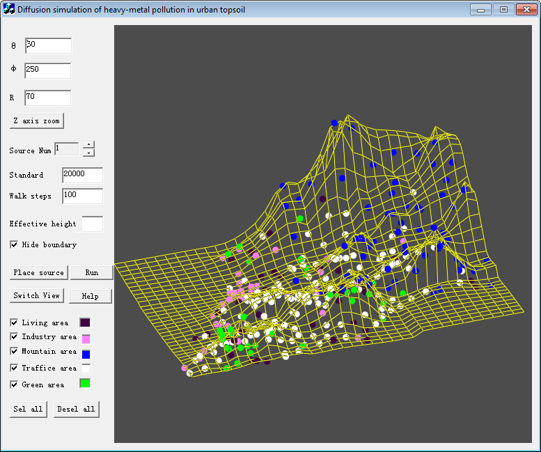

# Gravity
Gravity is a tool used to simualte the heavy metal pollution process. It was created many years ago. Sorry, I cannot find the source code except the executable file now. Please refer to the attached paper if you can read Chinese.

# Paper
- [The Aanlytical Model of Heavy Metal Pullution in Urban Topsoil](Report.pdf)
